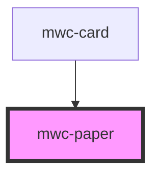

# mwc-paper

<!-- Auto Generated Below -->

## Properties

| Property    | Attribute   | Description | Type     | Default  |
| ----------- | ----------- | ----------- | -------- | -------- |
| `elevation` | `elevation` |             | `number` | `2`      |
| `height`    | `height`    |             | `string` | `'auto'` |
| `radius`    | `radius`    |             | `number` | `4`      |
| `width`     | `width`     |             | `string` | `'auto'` |

## Dependencies

### Used by

 - [mwc-card](../card)

### Graph

----------------------------------------------

*Built with [StencilJS](https://stenciljs.com/)*
